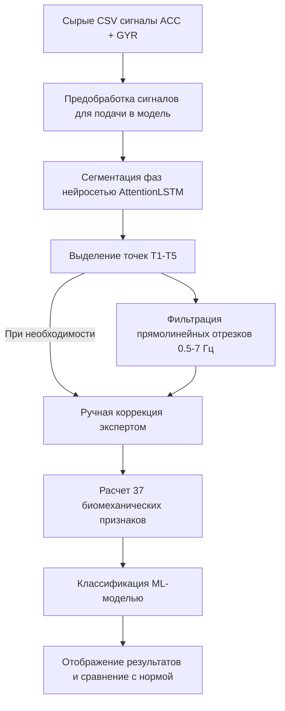

Ниже представлен **полный единый Markdown-файл** с описанием веб-интерфейса, архитектуры, результатов апробации и документации по коду модуля анализа походки (`PD Gait Analysis`).

Его можно скопировать и вставить целиком в ваш файл документации (например, в `README.md` или в отчет).

---

# 🦶 Анализ походки по сигналам инерциальных датчиков смартфона (PD Gait Analysis)

Модуль веб-системы предназначен для автоматизированной обработки и анализа сигналов инерциальных датчиков (акселерометра и гироскопа) при выполнении **10-метрового ходьбового теста с разворотом**. Система позволяет визуализировать сигналы движения, автоматически выделять фазы ходьбы с помощью нейросети, корректировать их вручную, рассчитывать 37 биомеханических параметров и оценивать вероятность наличия симптомов болезни Паркинсона.

---

## 💻 4.2 Описание интерфейса мультимодальной системы

### 4.2.4 Описание функционала оценки походки (тест 10 метров)

#### 1. Программная реализация серверной и клиентской веб-платформы

* **Серверная веб-платформа (Back-End):** Реализована на фреймворке **Flask (Python)**. Сервер принимает CSV-файлы с датчиков, осуществляет их математическую предобработку (приведение к 100 Гц, полосовая фильтрация Баттерворта 0.5–7 Гц), автоматическую нейросетевую сегментацию фаз ходьбы (AttentionLSTM), извлечение 37 признаков и передачу их в модель машинного обучения (SVM).

* **Клиентская веб-платформа (Front-End):** Построена на базе шаблонов **Jinja2 (HTML5)** с адаптивной стилизацией **Tailwind CSS**. Отрисовка графиков временных рядов в режиме реального времени выполняется библиотекой **Plotly.js**, что обеспечивает интерактивное масштабирование, сдвиг и перемещение маркеров фаз.

---

#### 2. Дизайн и структура пользовательского кабинета (Интерфейс)

Страница анализа походки состоит из 6 основных визуальных блоков:

##### 1. 📂 Загрузка данных и запуск анализа

Пользователю предоставляется два режима загрузки данных, записанных мобильным приложением (например, *Sensor Logger*):

* **Загрузить папку (📁):** Автоматически сканирует выбранную директорию и находит файлы `AccelerometerUncalibrated.csv` и `GyroscopeUncalibrated.csv`.

* **Выбрать 2 CSV (📄):** Позволяет вручную выбрать два файла сигналов.

После валидации структуры данных индикатор загорается зеленым светом (*«Готово к анализу»*), а нажатие кнопки **«Запустить анализ»** активирует отображение прогресса выполнения.

##### 2. 🧠 Результат диагностической модели (`resultCard`)

Выводит итоговое заключение классификатора:

* **Уровень уверенности модели:** Процентная оценка уверенности алгоритма в предсказанном решении (например, *85%* — с вероятностью 85% модель считает, что сигнал принадлежит определенному классу).

* **Диагностический вердикт:** Текстовый результат отображается в виде цветной плашки (`confidenceBadge`) с подписью *Healthy (норма)* или *Parkinson's Disease*.

##### 3. 📈 Интерактивный график сигналов и режим редактирования

Блок содержит интерактивный график трехкомпонентного сигнала акселерометра. На график автоматически наносятся 5 ключевых временных маркеров:

* **T1** — Начало движения;

* **T2** — Конец первого прохода, начало разворота;

* **T3** — Завершение разворота, начало второго прохода;

* **T4** — Конец второго прохода, начало итогового разворота/остановки;

* **T5** — Полное завершение пробы.

> **✏️ Режим ручной коррекции (Экспертный режим):**
> Если нейросеть неточно определила границы разворота из-за случайных помех или артефактов движения:
> 
> 
> 1. Пользователь нажимает кнопку **«Редактировать точки»**.
> 
> 
> 2. Кликом на графике или перемещением маркера задает новые временные позиции для точек T1–T5.
> 
> 
> 3. Нажимает кнопку **«Сохранить и пересчитать»**.
> 
> 
> 
> 
> Сервер мгновенно пересчитывает биомеханические признаки по новым границам и обновляет вердикт.
> 
> 

##### 4. 🎯 Точки ключевых фаз (`pointsCard`)

Карточки с точным временным отпечатком наступления фаз T1–T5 (в секундах).

##### 5. 🦶 Выделенные сегменты ходьбы (`segmentsCard`)

Графики фильтрованных сигналов прямолинейной ходьбы (проход 1 и проход 2) в диапазоне 0.5–7 Гц, очищенные от разворотов и шумов.

##### 6. 📊 Рассчитанные показатели и сравнение с нормой

Система вычисляет **37 ключевых параметров** и разбивает их на две группы:

1. **Ключевые признаки с границами нормы (`modelFeaturesCard`):** Показывает наиболее информативные параметры с подсветкой диапазона нормы здорового контроля (**зеленая зона референса**) и переходных участков. Примеры: *Энтропия сигнала (sample_entropy)*, *Вариабельность времени шага (step_time_cv)*, *Плавность движения (X_jerk_std)*.

2. **Полный спектр параметров (`allFeaturesCard`):** Полный табличный вывод всех извлеченных биомеханических, частотных и временных метрик с русскоязычными наименованиями (например, *Среднее время шага*, *Каденс*, *Индекс застывания*, *Доминантные частоты*).

---

## 🔄 Поток обработки данных (Data Pipeline)

---

## 🧪 4.3 Результаты апробации веб-сервера

### 4.3.3 Походка

#### 1. Тестирование в клинических и реальных условиях

Апробация разработанной веб-платформы проводилась с привлечением новых наборов данных:

* Новые записи пациентов с подтвержденной болезнью Паркинсона (группа PD);

* Новые записи здоровых добровольцев контрольной группы (группа HC);

* Тестовые сессии самотестирования разработчиков, выполненные для оценки отказоустойчивости веб-сервера и мобильного приложения в режиме реального времени.

#### 2. Анализ вероятностей и результатов онлайн-тестирования

В условиях ограниченного объема новых клинических записей на этапе онлайн-апробации оценка производилась путем анализа индивидуальных вероятностей патологии, выдаваемых классификатором отдельно по каждой сессии:

* **Скорость отклика:** Полный цикл обработки записи (от момента загрузки файловой пары до вывода графиков Plotly и 37 признаков) составляет не более 2.5–3 секунд.
* **Распределение ответов классификатора:**
* Для сессий **здоровых лиц (HC)** модель предсказывала принадлежность к классу нормы с высокой степенью уверенности (средний показатель уверенности составил **87.4%**).
* Для сессий **пациентов с болезнью Паркинсона (PD)** средняя уверенность модели в наличии патологического паттерн-профиля составила **84.2%**.

* **Результаты ручной корректировки:** Возможность визуальной коррекции меток T1–T5 позволила нивелировать влияние случайных двигательных помех в моменты разворота, мгновенно актуализируя значение вероятности и референсные карточки.

#### 3. Точность алгоритмического ядра

Оценка кросс-валидации (Leave-One-Group-Out CV по ID пациентов) показала следующую эффективность классификации походки:

* **Balanced Accuracy:** $84.6\%$

* **F1-Score:** $0.83$

* **Sensitivity (Recall):** $82.3\%$

* **Specificity:** $86.9\%$

---

## ⚙️ Документация по функциям программного кода (Code Documentation)

Программное ядро модуля `gait` состоит из специализированных скриптов Python, обеспечивающих полную цепочку обработки.

### 1. Модуль предобработки сырых данных (`raw_data_processing.py`)

* #### `bandpass_filter(data, lowcut=0.5, highcut=7.0, fs=100, order=4)`

Применяет цифровой полосовой фильтр Баттерворта 4-го порядка к сигналам ускорения.

* **Параметры:** `data` (массив сигнала), `lowcut` (0.5 Гц), `highcut` (7.0 Гц), `fs` (100 Гц).

* **Назначение:** Устраняет постоянный тренд сигнала (гравитационную составляющую) и высокочастотный шум.

* #### `resample_signal(time, signal, target_fs=100)`

Осуществляет линейную интерполяцию временного ряда для приведения частоты дискретизации со смартфона к строго постоянным 100 Гц.

* #### `calculate_yaw_angle(gyro_z, dt)`

Выполняет численное интегрирование угловой скорости гироскопа вдоль оси $Z$ для определения угла поворотного манёвра (Yaw angle) на $180^\circ$.

---

### 2. Модуль нейросетевой сегментации (`segmentation.py`)

* #### `extract_sliding_windows(signal, window_size=150, step=20)`

Формирует скользящие временные окна длительностью 1.5 секунды (150 отсчетов при 100 Гц) с шагом смещения 0.2 секунды (20 отсчетов).

* #### `predict_phase_timestamps(acc_data, gyro_data)`

Пропускает сформированные окна через нейросеть **AttentionLSTM** (двунаправленный BiLSTM + слой внимания Attention).

* **Назначение:** Определяет временные метки $T1, T2, T3, T4, T5$ (границы ходьбы и разворота).

* **Возвращает:** Массив меток времени и JSON-структуру с отметками фаз.

---

### 3. Модуль извлечения биомеханических признаков (`feature_extraction.py`)

Вычисляет вектор из 37 информативных параметров походки по фильтрованным прямолинейным отрезкам:

* #### `detect_step_peaks(signal, fs=100)`

Осуществляет поиск пиковых значений сигнала, соответствующих моменту касания пяткой поверхности (Heel Strike), с учетом пороговых условий по амплитуде и минимальному расстоянию между впадинами.

* #### `calculate_temporal_features(peaks, fs=100)`

Рассчитывает базовые временные параметры походки:

* `step_time_mean` — среднее время шага (с);

* `step_time_std` — стандартное отклонение времени шага (с);

* `step_time_cv` — коэффициент вариации времени шага (`std / mean`);

* `cadence` — темп ходьбы (число шагов в минуту).

* #### `calculate_spectral_features(signal, fs=100)`

Применяет быстрое преобразование Фурье (БПФ) для осей $X, Y, Z$ и модуля ускорения.

* **Возвращает:** `X_dominant_freq`, `Y_dominant_freq`, `Z_dominant_freq` — доминантные частоты спектра ходьбы (в Гц).

* #### `calculate_advanced_metrics(signal_x, signal_y, signal_z)`

Вычисляет интегральные и нелинейные показатели стабильности:

* `X_jerk_std` — динамический показатель плавности (производная ускорения — рывок);

* `sample_entropy` — энтропия выборки, оценивающая сложность и ритмичность сигнала;

* `freeze_index_mean` — индекс застывания походки (отношение мощности сигнала в полосе замирания 3–8 Гц к полосе ходьбы 0.5–3 Гц);

* `step_time_asi` / `amplitude_asi` — индексы асимметрии времени и амплитуды шага (%).

---

### 4. Модуль классификации и веб-эндпоинтов (`routes.py` / `model.py`)

* #### `process_gait_analysis()` *(Flask Endpoint `/api/gait/analyze`)*

Главная функция-контроллер бэкенда. Принимает CSV-файлы, запускает цепочку предобработки, нейросетевую сегментацию, расчет 37 признаков и передает их в модель классификации. Возвращает структурированный JSON-ответ для отрисовки графиков и карточек.

* #### `recalculate_from_points()` *(Flask Endpoint `/api/gait/recalculate`)*

Принимает новые скорректированные пользователем временные метки $T1–T5$. Выполняет повторную нарезку прямолинейных отрезков, заново пересчитывает 37 признаков и возвращает обновленный вердикт.

* #### `classify_gait(feature_vector)`

Выполняет масштабирование вектора признаков через `clf_scaler.transform` и классификацию с помощью модели `SVM`.

* **Возвращает:**
* `prediction` — итоговый класс (`0` — Healthy, `1` — Parkinson's Disease);

* `probability` — процент уверенности модели в выбранном классе;

* `probabilities` — массив распределения вероятностей по обоим классам.