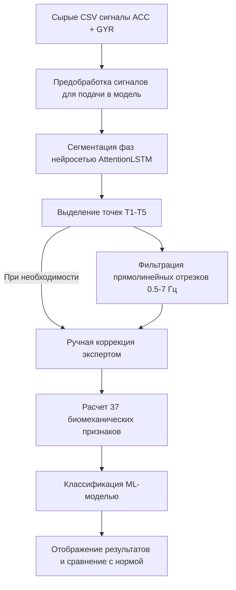

Ниже представлен **полный единый Markdown-файл** с описанием веб-интерфейса, архитектуры, результатов апробации и документации по коду модуля анализа походки (`PD Gait Analysis`).

Его можно скопировать и вставить целиком в ваш файл документации (например, в `README.md` или в отчет).

---

# 🦶 Анализ походки по сигналам инерциальных датчиков смартфона (PD Gait Analysis)

Модуль веб-системы предназначен для автоматизированной обработки и анализа сигналов инерциальных датчиков (акселерометра и гироскопа) при выполнении **10-метрового ходьбового теста с разворотом**. Система позволяет визуализировать сигналы движения, автоматически выделять фазы ходьбы с помощью нейросети, корректировать их вручную, рассчитывать 37 биомеханических параметров и оценивать вероятность наличия симптомов болезни Паркинсона.

---

## 💻 4.2 Описание интерфейса мультимодальной системы

### 4.2.4 Описание функционала оценки походки (тест 10 метров)

#### 1. Программная реализация серверной и клиентской веб-платформы

* **Серверная веб-платформа (Back-End):** Реализована на фреймворке **Flask (Python)**. Сервер принимает CSV-файлы с датчиков, осуществляет их математическую предобработку (приведение к 100 Гц, полосовая фильтрация Баттерворта 0.5–7 Гц), автоматическую нейросетевую сегментацию фаз ходьбы (AttentionLSTM), извлечение 37 признаков и передачу их в модель машинного обучения (SVM).

* **Клиентская веб-платформа (Front-End):** Построена на базе шаблонов **Jinja2 (HTML5)** с адаптивной стилизацией **Tailwind CSS**. Отрисовка графиков временных рядов в режиме реального времени выполняется библиотекой **Plotly.js**, что обеспечивает интерактивное масштабирование, сдвиг и перемещение маркеров фаз.

---

#### 2. Дизайн и структура пользовательского кабинета (Интерфейс)

Страница анализа походки состоит из 6 основных визуальных блоков:

##### 1. 📂 Загрузка данных и запуск анализа

Пользователю предоставляется два режима загрузки данных, записанных мобильным приложением (например, *Sensor Logger*):

* **Загрузить папку (📁):** Автоматически сканирует выбранную директорию и находит файлы `AccelerometerUncalibrated.csv` и `GyroscopeUncalibrated.csv`.

* **Выбрать 2 CSV (📄):** Позволяет вручную выбрать два файла сигналов.

После валидации структуры данных индикатор загорается зеленым светом (*«Готово к анализу»*), а нажатие кнопки **«Запустить анализ»** активирует отображение прогресса выполнения.

##### 2. 🧠 Результат диагностической модели (`resultCard`)

Выводит итоговое заключение классификатора:

* **Уровень уверенности модели:** Процентная оценка уверенности алгоритма в предсказанном решении (например, *85%* — с вероятностью 85% модель считает, что сигнал принадлежит определенному классу).

* **Диагностический вердикт:** Текстовый результат отображается в виде цветной плашки (`confidenceBadge`) с подписью *Healthy (норма)* или *Parkinson's Disease*.

##### 3. 📈 Интерактивный график сигналов и режим редактирования

Блок содержит интерактивный график трехкомпонентного сигнала акселерометра. На график автоматически наносятся 5 ключевых временных маркеров:

* **T1** — Начало движения;

* **T2** — Конец первого прохода, начало разворота;

* **T3** — Завершение разворота, начало второго прохода;

* **T4** — Конец второго прохода, начало итогового разворота/остановки;

* **T5** — Полное завершение пробы.

> **✏️ Режим ручной коррекции (Экспертный режим):**
> Если нейросеть неточно определила границы разворота из-за случайных помех или артефактов движения:
> 
> 
> 1. Пользователь нажимает кнопку **«Редактировать точки»**.
> 
> 
> 2. Кликом на графике или перемещением маркера задает новые временные позиции для точек T1–T5.
> 
> 
> 3. Нажимает кнопку **«Сохранить и пересчитать»**.
> 
> 
> 
> 
> Сервер мгновенно пересчитывает биомеханические признаки по новым границам и обновляет вердикт.
> 
> 

##### 4. 🎯 Точки ключевых фаз (`pointsCard`)

Карточки с точным временным отпечатком наступления фаз T1–T5 (в секундах).

##### 5. 🦶 Выделенные сегменты ходьбы (`segmentsCard`)

Графики фильтрованных сигналов прямолинейной ходьбы (проход 1 и проход 2) в диапазоне 0.5–7 Гц, очищенные от разворотов и шумов.

##### 6. 📊 Рассчитанные показатели и сравнение с нормой

Система вычисляет **37 ключевых параметров** и разбивает их на две группы:

1. **Ключевые признаки с границами нормы (`modelFeaturesCard`):** Показывает наиболее информативные параметры с подсветкой диапазона нормы здорового контроля (**зеленая зона референса**) и переходных участков. Примеры: *Энтропия сигнала (sample_entropy)*, *Вариабельность времени шага (step_time_cv)*, *Плавность движения (X_jerk_std)*.

2. **Полный спектр параметров (`allFeaturesCard`):** Полный табличный вывод всех извлеченных биомеханических, частотных и временных метрик с русскоязычными наименованиями (например, *Среднее время шага*, *Каденс*, *Индекс застывания*, *Доминантные частоты*).

---

## 🔄 Поток обработки данных (Data Pipeline)

---

## 1. Блок загрузки и предобработки сырых данных (`raw_data_processing.py`)

Этот блок отвечает за первичную очистку, фильтрацию и нормирование сигналов инерциальных датчиков (акселерометра и гироскопа), поступающих со смартфона.

* ### `resample_signal(time, signal, target_fs=100)`

* **Назначение:** Приведение временного ряда к постоянной частоте дискретизации.
* **Описание работы:** Так как датчики мобильного телефона записывают данные с плавающей частотой, функция выполняет линейную интерполяцию времён отсчётов `time` и значения сигнала `signal` к строго фиксированной частоте $100\text{ Гц}$.

* ### `bandpass_filter(data, lowcut=0.5, highcut=7.0, fs=100, order=4)`

* **Назначение:** Полосовая цифровая фильтрация сигнала.

* **Описание работы:** Применяет цифровой фильтр Баттерворта 4-го порядка. Подавление низких частот ($<0,5\text{ Гц}$) удаляет постоянный гравитационный тренд и медленные смещения, а подавление высоких частот ($>7,0\text{ Гц}$) сглаживает высокочастотный шум и дрожание.

* ### `calculate_yaw_angle(gyro_z, dt)`

* **Назначение:** Расчет угла поворота туловища вокруг вертикальной оси.

* **Описание работы:** Численно интегрирует угловую скорость гироскопа по оси $Z$ (`gyro_z`) по времени ($dt$). Позволяет фиксировать развороты испытуемого на $180^\circ$ во время 10-метрового теста.

---

## 2. Блок нейросетевой сегментации фаз ходьбы (`segmentation.py`)

Данный блок автоматически выделяет фазы прямолинейной ходьбы и разворотов, определяя временные метки $T1, T2, T3, T4, T5$.

* ### `extract_sliding_windows(signal, window_size=150, step=20)`

* **Назначение:** Нарезка сигнала на скользящие временные окна.
* **Описание работы:** Формирует массив отрезков длительностью $1,5\text{ секунды}$ ($150\text{ отсчетов}$) со смещением шага $0,2\text{ секунды}$ ($20\text{ отсчетов}$) для последующей подачи в глубокую нейросеть.

* ### `predict_phase_timestamps(acc_data, gyro_data)`

* **Назначение:** Автоматический поиск ключевых временных меток теста.

* **Описание работы:** Пропускает вектор оконных признаков через модель **AttentionLSTM** (двунаправленный BiLSTM со слоем внимания). Модель предсказывает вероятность принадлежности каждого отрезка к фазе прямолинейного движения или разворота.

* **Возвращает:** Временные метки $T1$ (начало движения), $T2$ (конец 1-го прохода), $T3$ (конец разворота), $T4$ (конец 2-го прохода) и $T5$ (полная остановка).

---

## 3. Блок расчета биомеханических признаков (`feature_extraction.py`)

На основе выделенных прямолинейных отрезков функция извлекает комплекс из **37 математических и биомеханических параметров**.

* ### `detect_step_peaks(signal, fs=100)`

* **Назначение:** Детектирование моментов контакта пятки с поверхностью (Heel Strike).

* **Описание работы:** Находит локальные максимумы (пики) ускорения по оси $X$, используя адаптивную фильтрацию по минимальной высоте пика и интервалу между ними.

* ### `calculate_temporal_features(peaks, fs=100)`

* **Назначение:** Расчет пространственно-временных параметров походки.

* **Описание работы:**
* `step_time_mean` — среднее время шага (с);

* `step_time_std` — стандартное отклонение длительности шага;

* `step_time_cv` — коэффициент вариабельности шага ($\text{std} / \text{mean}$);

* `cadence` — темп ходьбы (число шагов в минуту).

* ### `calculate_spectral_features(signal, fs=100)`

* **Назначение:** Спектральный анализ сигнала ходьбы.

* **Описание работы:** Выполняет быстрое преобразование Фурье (БПФ). Возвращает доминантные частоты `X_dominant_freq`, `Y_dominant_freq`, `Z_dominant_freq` в диапазоне $0,5$–$7\text{ Гц}$, отражающие основной ритм шагов.

* ### `calculate_advanced_metrics(signal_x, signal_y, signal_z)`

* **Назначение:** Расчет нелинейных и динамических показателей стабильности.

* **Описание работы:**
* `X_jerk_std` — показатель плавности движения (производная ускорения — рывок);

* `sample_entropy` — выборочная энтропия, оценивающая степень регулярности и хаотичности шагового ритма;

* `freeze_index_mean` — индекс застывания походки (отношение мощности сигнала в полосе эпизодов застывания $3$–$8\text{ Гц}$ к полосе обычной ходьбы $0,5$–$3\text{ Гц}$);

* `step_time_asi` / `amplitude_asi` — индексы асимметрии между левой и правой ногами.

---

## 4. Блок классификации и машинного обучения (`model.py`)

Этот блок отвечает за масштабирование признаков и вынесение диагноза на основе обученной ML-модели.

* ### `classify_gait(feature_vector)`

* **Назначение:** Оценка вероятности наличия болезни Паркинсона.

* **Описание работы:**
1. Переданный вектор признаков стандартизируется функцией `clf_scaler.transform(feature_vec)`.
2. Метод `clf_model.predict(scaled)` определяет наиболее вероятный класс (`0` — Healthy Control / Норма, `1` — Parkinson's Disease / Патология).

3. Метод `clf_model.predict_proba(scaled)` рассчитывает вектор вероятностей по обоим классам.

* **Возвращает:** Словарь с предсказанным классом `prediction`, процентом уверенности модели в вынесенном решении `probability` и массивом вероятностей `probabilities`.

---

## 5. Блок веб-контроллеров и API-эндпоинтов (`routes.py`)

Серверный блок на **Flask**, организующий взаимодействие пользовательского веб-интерфейса с алгоритмическим ядром на Python.

* ### `process_gait_analysis()` *(Эндпоинт `/api/gait/analyze`)*

* **Назначение:** Полный автоматический цикл первичного анализа загруженных файлов.
* **Описание работы:**
1. Принимает два файла `AccelerometerUncalibrated.csv` и `GyroscopeUncalibrated.csv`.
2. Последовательно вызывает `resample_signal`, `bandpass_filter`, `predict_phase_timestamps` и вычисляет вектор из $37$ признаков.

3. Вызывает `classify_gait` и возвращает клиенту JSON-структуру с диагнозом, координатами временных точек $T1$–$T5$, графиками сигнала и признаками.

* ### `recalculate_from_points()` *(Эндпоинт `/api/gait/recalculate`)*

* **Назначение:** Перерасчет параметров после экспертной коррекции врачом.
* **Описание работы:**
1. Принимает новые координаты точек $T1$–$T5$, вручную измененные пользователем на графике.
2. Выполняет повторную нарезку прямолинейных отрезков ходьбы.
3. Мгновенно пересчитывает все $37$ признаков, повторно вызывает `classify_gait` и обновляет диагностическое заключение на экране.